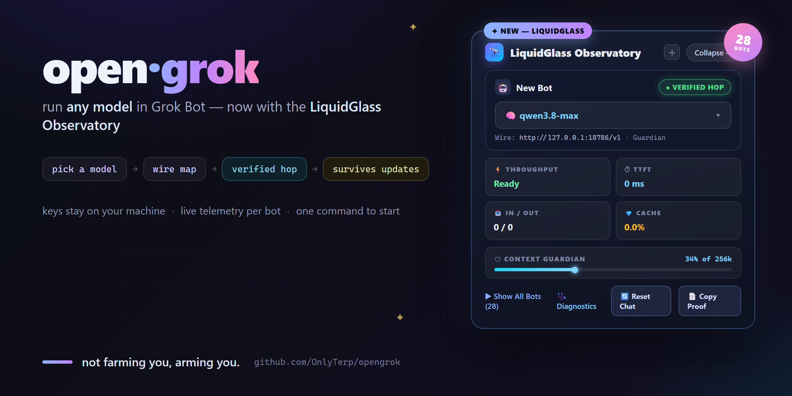
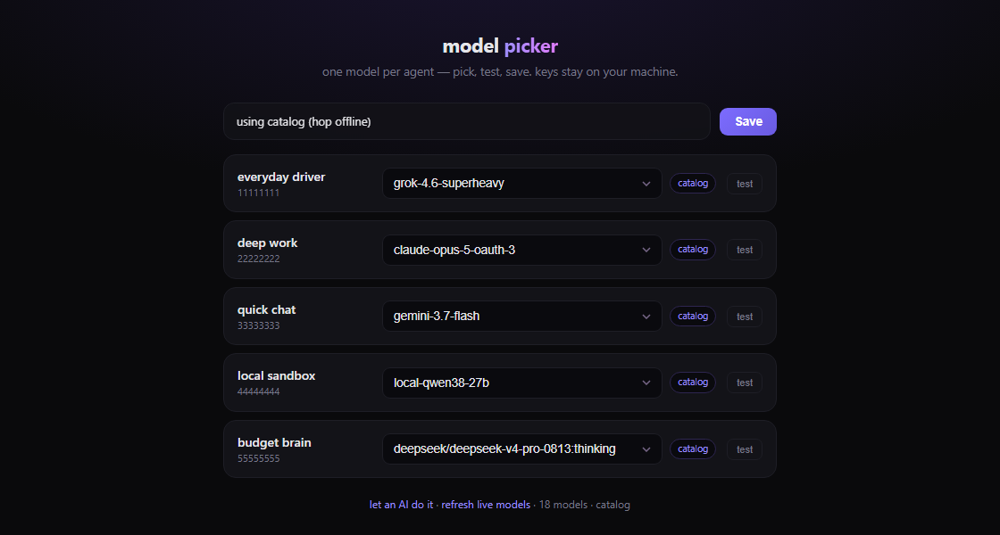

<p align="center">
  
</p>

<p align="center">
  <a href="#before-you-start"></a>
  <a href="LICENSE"></a>
  <a href="#the-laws"></a>
  <a href="https://github.com/OnlyTerp/opengrok/actions/workflows/verify.yml"></a>
  
  
</p>

# opengrok

Configuration and wire-mapping tools for **[Grok Bot](https://grok.x.ai/)** agents.

Use this repository to assign a model per agent, apply verified provider request
shapes, and detect when a Grok Bot update breaks your setup. Keys stay on your
machine.

---

## What this is

This repository is a **sidecar for an existing Grok Bot install**. It helps you:

- Write and edit `model-bindings.json` (which agent uses which model and local endpoint)
- Map reasoning / effort / thinking controls to each provider’s real wire format
- Run a picker UI to choose models, send a live test request, and save bindings
- Run `doctor.py` to baseline files and localhost services and catch drift after updates

If you already run Grok Bot and want foreign models (or subscription lanes) to
behave correctly, this is the right tool.

---

## What this is not

This repository **does not**:

- Install, host, or emulate Grok Bot
- Turn this computer into a Grok Bot machine
- Give agents control of your Mac, PC, or files by itself
- Use a Cursor subscription (or any IDE subscription)
- Ship auth proxies (“shims”) for Claude, Codex, Gemini, and similar plans

Cloning and running `setup.py` alone does **not** create bots that can operate
your machine. Without Grok Bot (local app or cloud host), bindings have nothing
to drive.

---

## Before you start

You need all of the following:

| Requirement | Why |
|---|---|
| **Grok Bot** already installed (or a cloud/box host you control) | This repo only configures that product |
| A reachable **OpenAI-compatible** endpoint for each model lane | Bindings point at `http://127.0.0.1:<port>/v1`, not at vendor consoles directly |
| For subscription providers (Claude plans, ChatGPT/Codex, Google AI): a **local shim** you already run | Shims attach OAuth/session auth; this repo does not include them |

A **shim** is a small localhost proxy. Grok Bot calls it like a normal
`/v1/chat/completions` API. The shim adds credentials and forwards to the real
upstream. Example ports this tooling looks for: Claude `:18776`, Codex
`:18777`, Antigravity/Gemini `:18778`, Grok `:18779`.

If you do not have Grok Bot, stop here and install that product first. If you
wanted a self-hosted agent runtime on this machine, this repository is the wrong
project.

---

## Quick start

```bash
git clone https://github.com/OnlyTerp/opengrok
cd opengrok
python setup.py
```

`setup.py` detects your Grok Bot config directory and any live localhost
services, adopts or creates bindings, writes `services.json` for the doctor,
baselines the machine, and opens the picker.

Then:

1. Pick a model for each agent
2. Test it with a live request
3. Save

```bash
python tools/doctor.py        # health / drift check
python tools/qa.py            # repo self-check: leaks, refs, tests
```

When setup asks for an **OpenAI-compatible base URL**, enter your local hop or
shim root ending in `/v1` (for example `http://127.0.0.1:18777/v1`). That is not
a request for an OpenAI API key, and it is not Cursor.

---

<p align="center">
  
</p>

## What it gives each model

Dropping a foreign model into Grok Bot often “works” but feels off — slower,
shallower, or token-heavy. That is usually harness mismatch: the model was
trained against a specific request shape and receives generic knobs instead.
opengrok fixes the wire:

| Model family | What goes wrong vanilla | What opengrok does |
|---|---|---|
| **Grok (xAI)** | effort knob is `xhigh`, not `max`; `fast` has no field | literal token mapping, always-on reasoning documented |
| **GLM (Zhipu)** | thinks by default — silence is *expensive*; `max` is real | verified token table + true off-switch via `thinking:disabled` |
| **Claude** | thinking is owned by the auth shim; body-painting it 400s | shim-owned thinking, effort passes clean |
| **Gemini** | "fast" was decorative — the knob is the *slug*, not a field | fast lane rerouting, measured 1.5s → 0.9s first token |
| **DeepSeek** | thinking lives in the model slug, not the body | slug-owns-thinking mapping |
| **local models** | context/recovery edges | dedicated route, fail-closed |

Every row is backed by a capture in `wire-captures/`
(see [glm-5.3-flash](wire-captures/glm-5.3-flash/) for a full ladder).

## How it fits together

```
 Grok Bot agent
      │  modelId + parameters (thinking/effort/fast)
      ▼
 provider-maps ──► per-provider wire truth (verified, versioned, tested)
      │
      ▼
 localhost hop/shim (auth) ──► upstream provider
```

**Two contracts:**

- `provider-maps.cjs` — Contract A: direct body maps (client-side lanes)
- `provider-maps-hop.cjs` — Contract B: `applyHarnessControls()` for hop lanes

**Cloud agents need one more step.** Stock Grok Bot cloud hosts do not read
`model-bindings.json` until you install the binding consumer.
`tools/apply-box-patch.py` patches the host; `tools/file-relay.py` receives
pushed bindings. See [CLOUD-HOST](docs/CLOUD-HOST.md).

## Update survival

Grok Bot updates can rewrite its bundle. `doctor.py` baselines your machine on
setup and reports exactly what moved. Use `--quiet` for cron. Maps hot-reload.

## The laws

- **Evidence or it doesn't ship.** No map without a wire capture (`tools/wire-probe.py`).
- **200-accepted ≠ honored.** Behavior-prove every knob.
- **Silence is not cheap.** Several providers think by default.
- **Connection pooling:** thread-local keep-alive or nothing under load.
- **Fail-closed over fake success.** Unexpressible controls are documented noops.

## Testing

```bash
node tools/test-provider-maps.cjs       # Contract A
node tools/test-provider-maps-hop.cjs   # Contract B
python tools/qa.py                      # leak scan, ref integrity, suites
```

CI runs all three on every push and PR.

## Adding a provider

```bash
python tools/wire-probe.py --base https://api.example.com/v1 --model their-model --key-env THEIR_API_KEY
```

Attach the capture to the PR. See `CONTRIBUTING.md` — **no capture, no merge.**

## Voice assistant (`voice/`)

Optional local realtime voice stack on the same wire-truth approach (STT,
OpenAI realtime captain, ElevenLabs TTS). It is separate from Grok Bot model
bindings. See [voice/README.md](voice/README.md) · [voice/SETUP.md](voice/SETUP.md).

## Status

- Working today: Grok, GLM, Claude plans, Gemini (incl. fast lane), DeepSeek, local llama.cpp
- Pattern proven, capture pending: OpenRouter, Groq, Mistral, xAI OAuth
- Docs: [MODEL-GUIDELINES](docs/MODEL-GUIDELINES.md) · [BYOK vs hop](docs/BYOK-DECISION.md) · [FAILURE-MODES](docs/FAILURE-MODES.md) · [CLOUD-HOST](docs/CLOUD-HOST.md) · [ROADMAP](docs/ROADMAP.md)

---

<p align="center">
  <sub>not farming you, arming you.</sub>
</p>
