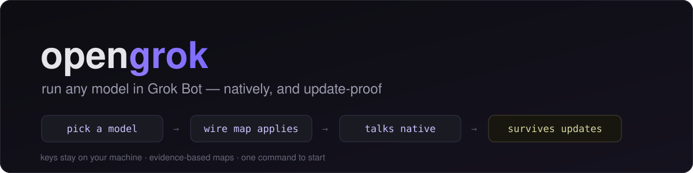

<p align="center">
  
</p>

# Making Any Model Work Properly in Grok Bot

The complete guide. Everything here comes from a production multi-provider deployment; each rule exists because skipping it caused a real incident.

---

## 0. Mental model

```
Grok Bot host ──turn──> model-bindings.json (routing authority, read fresh EVERY turn)
                        │  modelId + hopBaseUrl (+ maxMode/parameters)
                        ▼
              hop shim (localhost:N)          <-- ONE per credential/trust domain
                        │  adds Authorization / client identity headers
                        ▼
              upstream provider API           <-- speaks its own wire dialect
```

Two jobs decide whether your model feels native:

1. **Route correctly** — bindings are read at turn time; `hopBaseUrl` wins over stale `baseUrl` metadata.
2. **Speak the dialect + carry the identity** — done by the provider map (params→fields) and the hop shim (secrets/headers).

---

## 1. Adding a model, step by step

### Step 1 — Classify the route
Ask three questions:
- **Does the provider accept plain OpenAI-compatible chat/completions with nothing special?** (most do) → tiny/no map needed.
- **Does it require its own fields to think at all?** (Claude thinking objects, DeepSeek `thinking:{type:"enabled"}`, GLM CODING endpoint vs general endpoint) → needs a wire map.
- **Does it authenticate by subscription session rather than a plain API key?** (Claude Pro/Max OAuth, ChatGPT/Codex plan, Google sub through IDE clients) → needs a hop shim carrying trusted identity.

### Step 2 — Write the binding (schema)

```json
"<agent-uuid>": {
  "name": "My Agent",
  "modelId": "<exact-upstream-slug>",
  "provider": "<label-for-audit-only>",
  "hopBaseUrl": "http://127.0.0.1:<port>/v1",
  "maxMode": false,
  "parameters": [ { "id": "effort", "value": "high" } ]
}
```

Hard rules (host-enforced):
- `modelId` required; use the **slug conventions** (e.g. `-high` suffix = effort, see §3).
- `hopBaseUrl` must be exactly `http://127.0.0.1:<port>/v1` — no creds, no query strings. This is WHY secrets must be shim-side.
- `parameters` is an array of `{id,value}` STRING pairs. Reading code tolerates booleans; write strings.
- `provider` is metadata/audit only — resolution never reads it.

### Step 3 — Wire map (if the provider needs one)
See `tools/provider-maps.cjs` for the working reference and the exact contract:

```text
applyProviderReasoningControls(body, ctx)
  -> mutates body ONLY for understood routes
  -> returns audit label ("grok" | "claude-passthrough" | "gemini-slug"
                          | "deepseek-thinking" | ... | "none")
```

Law: routes you have NOT verified get `"none"` and an untouched body. See §4 for why half-maps are worse than no maps.

Worked examples shipped and tested (17/17):

| Route detector | Map |
|---|---|
| `claude-*` or `:18776` | **pass-through BY DESIGN** — the lane's shim already pins thinking/tool-sanitize state; emitting more fights it |
| `gemini-*` + family `gemini-3.6-flash` exactly | effort → distinct real slugs (`-low/-medium/-high`, max clamps high); other families untouched |
| `deepseek-*` (or nano-gpt base) with `:thinking` slug or thinking param | top-level `thinking:{type:"enabled"}`, default `reasoning_effort:"high"`, `max_tokens` gap-fill **only if caller omitted it** |
| grok-* | maxMode→`xhigh`; fast:true→low override; thinking no-op (always-on); context display-hint only |

### Step 4 — Hop shim (if subscription-auth)

Copy `tools/hop-server.py`. It forwards anything to your target service while injecting `Authorization: Bearer <key-from-env>`. Requirements baked in:
- key from ENV or a local dotfile — **never** hardcoded, never logged;
- chunk-streams both directions so SSE replies stream unbuffered;
- `/healthz` answers locally so doctors don't wake the upstream;
- loopback bind by default.

Persist it like other launchers (Windows Startup `.vbs` calling `pythonw server.py`, systemd unit on Linux) so it survives reboots.

### Step 5 — Prove it before trusting it
- Static: unit tests for the map (`node tools/test-provider-maps.cjs`).
- Liveness: `GET /models` through the hop; NEGATIVE CONTROL: same call without the hop must be rejected (401). If both succeed, your auth boundary is decorative.
- One approved end-to-end POST, streamed, asserting visible text AND clean `[DONE]`.
- Then enroll in the doctor (below).

---

## 2. Secrets law

- Bindings/host configs contain **ports and slugs only**. Ever.
- Credentials live in env vars, OS credential stores, or mode-600 dotfiles read by the shim.
- Shims NEVER log Authorization values or full bodies. Line-logs metadata only.
- On anything shared/public: grep the tree for `sk-`, `Bearer `, long JWT-shaped strings before every push.

---

## 3. Slug & effort conventions (don't reinvent)

Effort rides the SLUG, not a body field, whenever the upstream CLI ecosystem does it that way:
- `-fast` / bare = low effort variant; `-low/-medium/-high/-xhigh` suffixes; `:thinking` opt-in marker.
- The map converts harness `effort=max` etc. into whatever the lane actually honors (body field for xAI/DeepSeek, distinct slugs for Gemini families).
- Never emit "none" for always-on-reasoning providers (xAI has no off switch) — omitting the field IS the correct default.

---

## 4. Token-waste and dumbness killers (the part everyone misses)

These made models FEEL broken even with perfect auth. Each is a measured incident, not theory.

| Killer | Symptom | Root cause | Fix |
|---|---|---|---|
| **Generic harness shape** | provider-RL-trained model answers noticeably dumber than its own benchmarks; verbose "here" filler | request lacks the fields its training harness always sent (DeepSeek v4 without `thinking:{type:enabled}`+high effort reads its world differently) | ship the wire map; test with a known-answer probe |
| **Effort stuck at defaults** | smart model gives quick-shallow takes | shim injected medium because caller omitted effort; or slug parses suffix wrong | explicit effort in parameters; assert the resolved value in a shim log line ONCE |
| **Summarizer eating the lane** | long dead-air then gibberish memory | background summaries pinned to the same single-GPU/same-quota lane generated 100k+ tokens | dedicated summarizer route OR strip tools+cap output for summary calls; suppress async summaries on constrained lanes |
| **Compaction loops** | budget burned, still no answer | failed turns re-enter summarize→main loops; second attempt identical | strict one-compaction-per-turn budget, fail closed, reset only on new user turn |
| **Retry storms on blips** | provider hiccup converts into fleet-wide failover | transient 5xx treated as exhaustion; synthetic 429s evict healthy lanes | same-plan immediate retry for blips; cooldown+budget only after PERSISTED errors; return REAL status codes, never synthesized ones |
| **Discovery floods** | curated picker drowned under hundreds of remote entries | `discover_models: true` left on after setup | curate inline list, flip discovery OFF |
| **Reasoning payload dropped in transit** | TypeError mid-run kills a 23-minute job, all work lost | wire-level fields passed as SDK kwargs instead of body/extra_body | allowlist known kwargs; unknown keys merge into extra_body/body root |

Write these as assertions somewhere testable — memory fades, regressions don't announce themselves.

---

## 5. Surviving Grok Bot updates (the silent-update problem)

Stock hosts get replaced by self-updates; your patches/bindings vanish or get refused. Pattern that works, layered:

1. **Attestation** — keep SHA-256 of stock host + your patch outputs + binding file. At startup (or via watchdog) recompute; any drift is either "vendor updated me" or "something edited my stuff" — both deserve a loud event, never a shrug.
2. **Current-only gate** — refuse to run against a host version you haven't reviewed. Better down-than-silently-rerouted. Re-baseline deliberately: rerun `doctor.py --init` AFTER inspecting diffs.
3. **Cache-staleness tripwire** — provider caches (model lists) carry fetch dates + app versions; stale cache = the update path moved. Alert on age.
4. **Persistence inventory** — every launcher (VBS/unit/Task Scheduler) checked present each cycle; a vanished launcher predicts next-boot breakage.
5. **Fail-closed routing** — bound-route errors must NOT fall through to some global/default provider masquerading as your model (classic symptom: "usage limit" card while your local stack sits idle and healthy).

`tools/doctor.py` implements 1–4 and is cron-ready (`--quiet` prints nothing when clean, exits nonzero otherwise).

---

## 6. Testing discipline (short version; details in docs/TESTING.md)

- **Positive control:** break the thing on purpose (kill a port, point at a 401). Detection MUST fire. If it stays green, fix the DETECTOR first.
- **Negative control:** the auth boundary must reject. Both-open = worst outcome of all.
- **Never parse your own tail:** don't pipe verification commands through filters that eat exit codes.
- **One honest live probe maximum** when lanes are metered — static/unit verification first, live call last, approved.

---

## 7. Pitfalls gallery (OS/shell)

Windows + bash-flavored shells bite hard:
- Some environments disable MSYS flag conversion → double-slash flags (`cmd //c`, `taskkill //F`) reach native tools RAW: cmd opens INTERACTIVE and exits 0 having done nothing. Use single-slash; verify effects afterwards.
- Launch `.cmd` scripts with explicit working directories; inherited cwds from previous commands produce orphaned launches that report success.
- Locked browser cookie DBs decrypt for nobody while the browser runs — automation needing those cookies uses its own profile directory.
